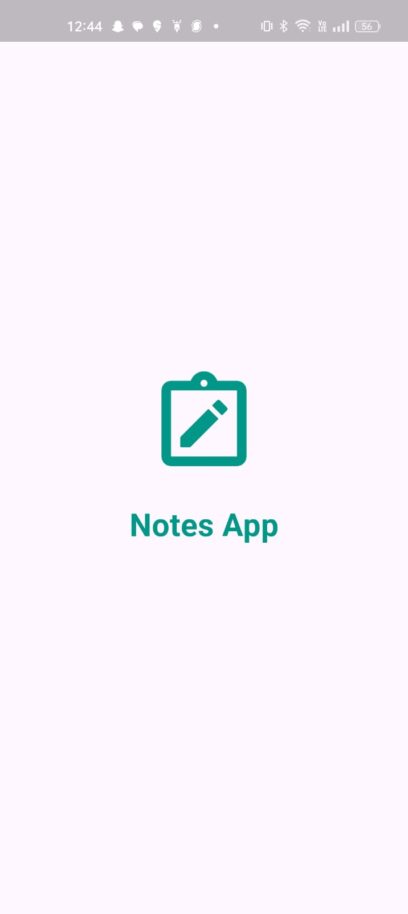
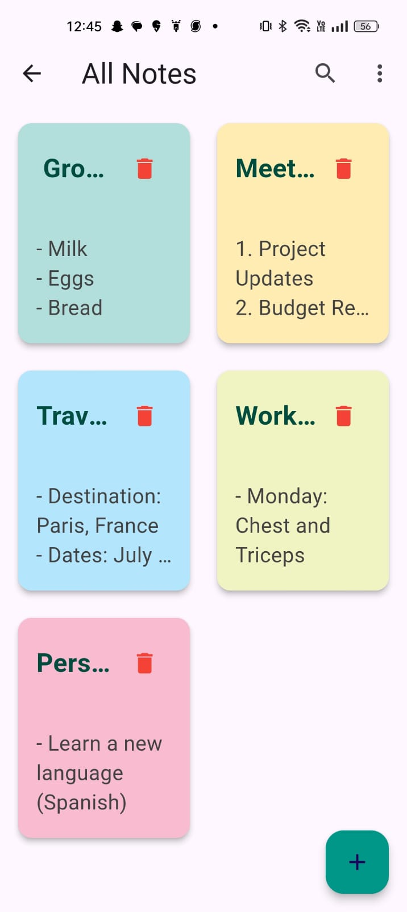
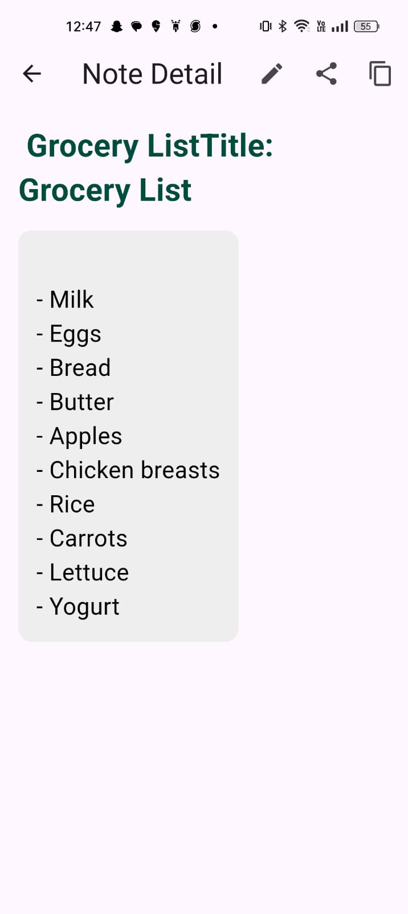
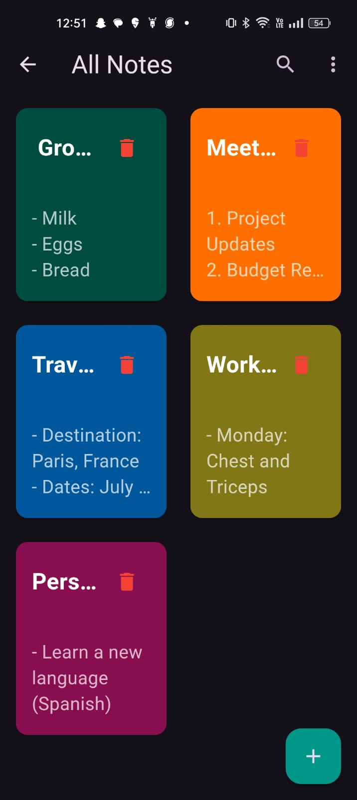
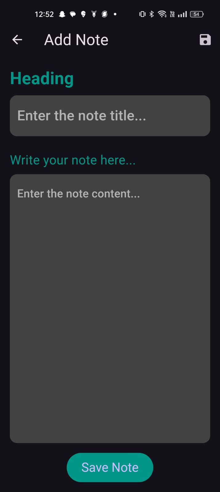
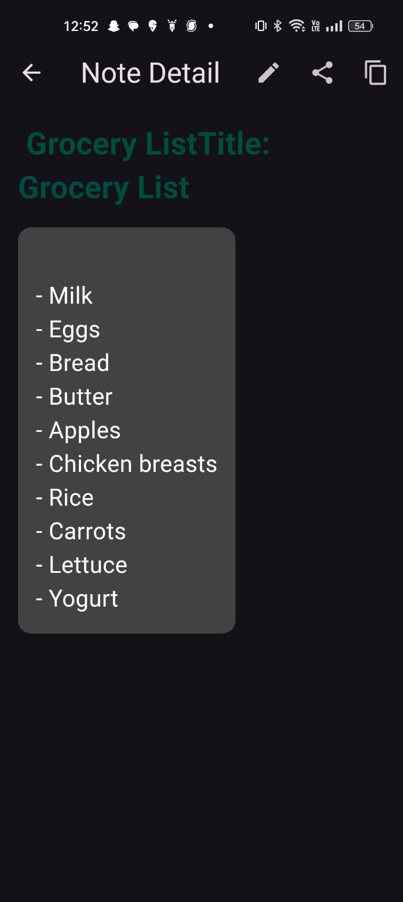

# Notes App

A simple and efficient Notes App built with Flutter. This app allows users to create, read, update, and delete notes. It also includes features like search, copy to clipboard, and share notes. Users can switch between light and dark mode as per their preference.

## Features

- Create and add new notes
- View note details
- Edit notes
- Delete notes
- Search notes
- Copy note content to clipboard
- Share notes
- Switch between light and dark mode

## Database

This app uses a local SQfite database to store notes locally on the device. The `notes_database.dart` file in the `lib/data` directory manages the database operations including creating, reading, updating, and deleting notes.

## Screenshots

### Splash Screen


### Light Mode

#### Home Screen


#### Note Detail


### Dark Mode

#### Home Screen


#### Add Note


#### Note Detail


## Getting Started

### Prerequisites

- [Flutter](https://flutter.dev/docs/get-started/install) should be installed on your system.
- An editor such as [VSCode](https://code.visualstudio.com/) or [Android Studio](https://developer.android.com/studio).

## Usage

### Adding a Note

1. Click on the "+" button on the home screen.
2. Enter the title and content of the note.
3. Click the "Save" button to add the note.

### Viewing Note Details

- Click on any note in the home screen to view its details.

### Editing a Note

1. On the Note Detail page, click the "Edit" button.
2. Modify the title or content.
3. Click the "Save" button to update the note.

### Deleting a Note

- Click the trash icon on the note in the home screen or note detail page to delete it.

### Searching for a Note

- Use the search icon on the home screen to search for notes by title or content.

### Copying Note Content

- On the Note Detail page, click the "Copy" icon to copy the note's content to the clipboard.

### Sharing a Note

- On the Note Detail page, click the "Share" icon to share the note's content.

### Switching Between Light and Dark Mode

- Use the toggle in the app settings or the theme switcher icon to switch between light and dark mode.

## Installation

1. **Clone the repository:**
    ```sh
    git clone https://github.com/your-username/notes-app.git
    cd notes-app
    ```

2. **Get the dependencies:**
    ```sh
    flutter pub get
    ```

3. **Run the app:**
    ```sh
    flutter run
    ```

## Folder Structure

```sh
.
├── android                  # Android specific files
├── assets                   # Asset files (e.g., images, fonts)
├── ios                      # iOS specific files
├── lib                      # Main source code
│   ├── data                 # Data management (e.g., database)
│   │   └── notes_database.dart
│   ├── models               # Model classes
│   │   └── note.dart
│   ├── pages                # UI pages
│   │   ├── add_note_page.dart
│   │   ├── get_started_page.dart
│   │   ├── home_page.dart
│   │   └── note_detail_page.dart
│   ├── utils                # Utility classes and functions
│   │   └── debouncer.dart
│   ├── theme_mode_notifier.dart # Theme mode management
│   └── main.dart            # Main entry point
├── screenshots              # Screenshots for the README
└── pubspec.yaml             # Project configuration file
  ```
## Contribution

Contributions are welcome! Please fork this repository and submit a pull request for any enhancements or bug fixes.

